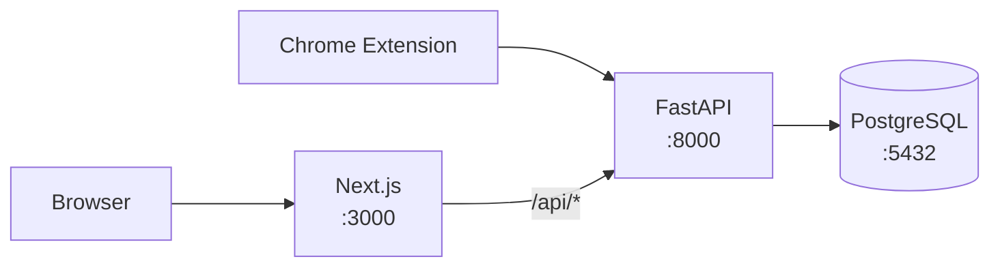

# Nodebyte

A modern digital inventory manager built for IT teams. Track every device, site, and service your team depends on. Search by name, tag, host, IP, or URL. Automate via REST API. Keep your operational knowledge tidy.


## Features

- **Fast search** — find any node instantly by name, hostname, IP, URL, or tags
- **Multi-tenant teams** — create teams with roles (owner, admin, member, viewer) and switch context in one click
- **REST API** — automate node registration from deploy scripts, monitoring, or CI/CD pipelines
- **Registration tokens** — let servers and agents self-register as nodes without user credentials
- **Browser extension** — add any website to your inventory with one click (Chrome, Manifest V3)
- **Bookmark sync** — nodes with URLs automatically sync to browser bookmarks, organized by kind
- **Bulk operations** — multi-select nodes to delete or tag in batch
- **Invite system** — invite team members by email with role-based access

## Architecture



The frontend proxies all `/api/*` requests to the backend, keeping auth cookies same-origin. The Chrome extension talks directly to the backend API.

## Prerequisites

- [Docker Engine](https://docs.docker.com/engine/install/) with the [Compose plugin](https://docs.docker.com/compose/install/) (`docker compose`)

That's it. No local Python, Node.js, or PostgreSQL install required.

## Quickstart

```bash
# 1. Clone the repo
git clone https://github.com/your-org/nodebyte.git
cd nodebyte

# 2. Copy the example env file and edit as needed
cp .env.example .env

# 3. Start everything
docker compose up --build
```

Once the containers are healthy:

| Service  | URL                          |
|----------|------------------------------|
| Frontend | http://localhost:3000         |
| API      | http://localhost:8000         |
| API Docs | http://localhost:8000/docs    |

Register your first account at http://localhost:3000/register. The first team is created automatically during registration.

## Configuration

All configuration is done through environment variables. Set them in your `.env` file or pass them directly to Docker Compose.

### Backend

| Variable | Description | Default |
|----------|-------------|---------|
| `DATABASE_URL` | PostgreSQL connection string | *(set by docker-compose)* |
| `JWT_SECRET` | Secret key for signing JWTs — **change in production** | *(required)* |
| `JWT_ISSUER` | Issuer claim in JWTs | `nodebyte` |
| `ACCESS_TOKEN_EXPIRES_MINUTES` | Access token lifetime | `15` |
| `REFRESH_TOKEN_EXPIRES_DAYS` | Refresh token lifetime | `30` |
| `COOKIE_SECURE` | Set `true` when serving over HTTPS | `false` |
| `COOKIE_SAMESITE` | SameSite cookie policy (`lax`, `strict`, `none`) | `lax` |
| `FRONTEND_ORIGIN` | Allowed CORS origin for the frontend | `http://localhost:3000` |
| `REGISTRATION_ENABLED` | Allow public user registration (`false` = invite-only) | `true` |
| `TURNSTILE_ENABLED` | Enable Cloudflare Turnstile bot protection | `true` |
| `TURNSTILE_SECRET_KEY` | Turnstile secret key (use test key for dev) | *(test key)* |
| `NODEBYTE_ENV` | Environment name (`dev` or `production`) | `dev` |

### Frontend

| Variable | Description | Default |
|----------|-------------|---------|
| `NEXT_PUBLIC_API_BASE_URL` | Backend API URL (used client-side) | `http://localhost:8000` |
| `NEXT_PUBLIC_TURNSTILE_SITE_KEY` | Turnstile site key (use test key for dev) | *(test key)* |

### Docker Compose

| Variable | Description | Default |
|----------|-------------|---------|
| `POSTGRES_DB` | Database name | `nodebyte` |
| `POSTGRES_USER` | Database user | `nodebyte` |
| `POSTGRES_PASSWORD` | Database password — **change in production** | `changeme` |
| `POSTGRES_PORT` | Host port for PostgreSQL | `5432` |

## Browser Extension

The Nodebyte browser extension lets you add websites to your inventory with one click.

### Build

```bash
./create-extension.sh
```

This creates `frontend/public/downloads/extension.tar.gz` and an `extension-meta.json` with version info. The download page at `/download` picks these up automatically.

### Install (sideload)

1. Extract the `extension` folder from the archive
2. Open `chrome://extensions` and enable **Developer mode**
3. Click **Load unpacked** and select the `extension` folder
4. Click the Nodebyte icon in your toolbar, open **Settings**, and set your API URL

The extension connects directly to the backend API (e.g. `http://localhost:8000`).

## Seed Data

A helper script generates 100 random nodes for testing:

```bash
NODEBYTE_EMAIL="you@example.com" NODEBYTE_PASSWORD="yourpassword" python3 scripts/seed_nodes.py
```

You must have a registered account and the backend running on `http://localhost:8000`.

## Production Deployment

When deploying to production, address each item in this checklist:

- [ ] **`JWT_SECRET`** — set to a long random string (`openssl rand -hex 32`)
- [ ] **`POSTGRES_PASSWORD`** — set to a strong, unique password
- [ ] **`COOKIE_SECURE=true`** — required when serving over HTTPS
- [ ] **`COOKIE_SAMESITE=lax`** — or `strict` if frontend and API share a domain
- [ ] **`FRONTEND_ORIGIN`** — set to your actual frontend URL (e.g. `https://nodebyte.example.com`)
- [ ] **`NEXT_PUBLIC_API_BASE_URL`** — set to your actual API URL
- [ ] **Turnstile** — replace test keys with real Cloudflare Turnstile keys, or set `TURNSTILE_ENABLED=false` to disable
- [ ] **Uvicorn** — remove `--reload` from `backend/entrypoint.sh` and consider adding `--workers N`
- [ ] **HTTPS** — terminate TLS with a reverse proxy (nginx, Caddy, Traefik) in front of the containers
- [ ] **Volumes** — ensure `nodebyte_postgres` is backed up or mapped to persistent storage

## API Documentation

The backend auto-generates interactive API documentation:

- **Swagger UI** — `http://localhost:8000/docs`
- **ReDoc** — `http://localhost:8000/redoc`

All endpoints are under `/api/`. Authentication uses JWT bearer tokens with HTTP-only refresh token cookies.

## Project Structure

```
nodebyte/
├── backend/              # FastAPI application
│   ├── app/
│   │   ├── api/          # Route handlers
│   │   ├── core/         # Config, security, RBAC
│   │   ├── models/       # SQLAlchemy models
│   │   ├── schemas/      # Pydantic schemas
│   │   └── services/     # Business logic
│   ├── alembic/          # Database migrations
│   ├── Dockerfile
│   └── entrypoint.sh
├── frontend/             # Next.js application
│   ├── src/
│   │   ├── app/          # Pages (App Router)
│   │   ├── components/   # React components
│   │   └── lib/          # API client, auth context
│   ├── Dockerfile
│   └── entrypoint.sh
├── extension/            # Chrome extension (Manifest V3)
│   ├── manifest.json
│   └── src/
├── scripts/              # Utility scripts
├── docker-compose.yml
└── create-extension.sh
```

## License

[MIT](LICENSE) — DeltaOps Technology, LLC
