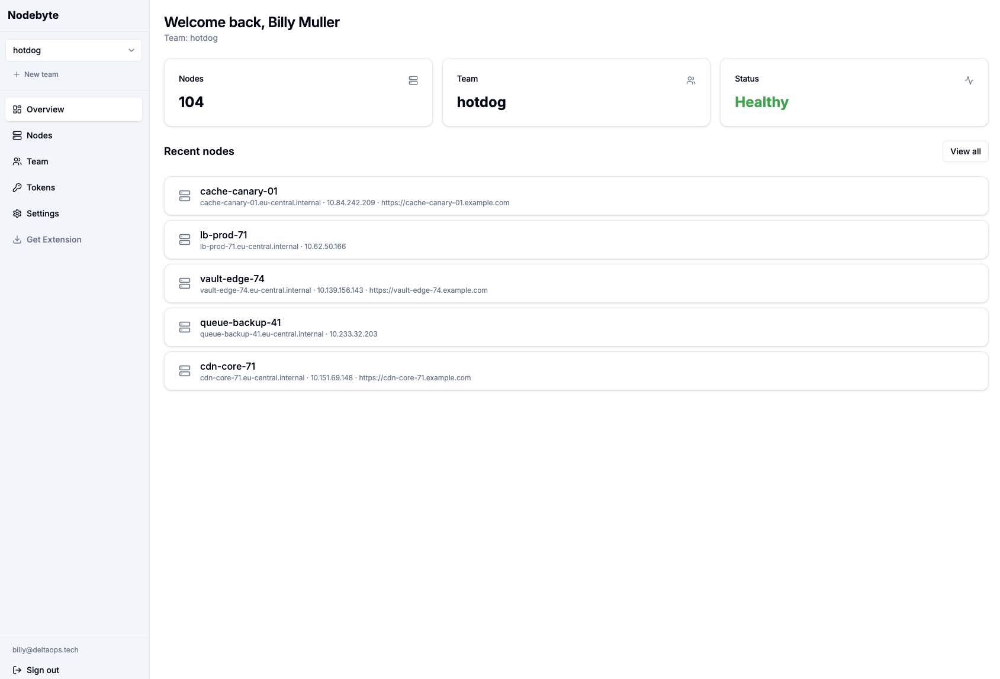
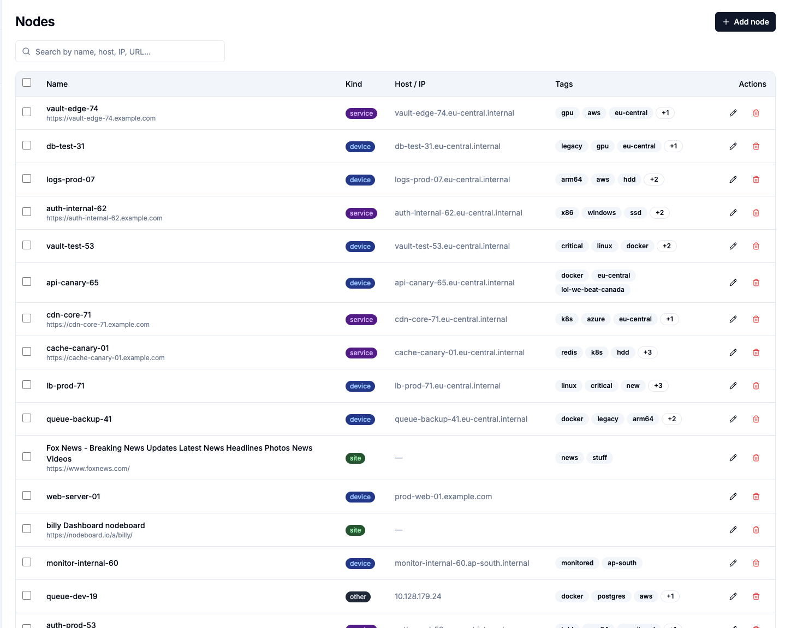
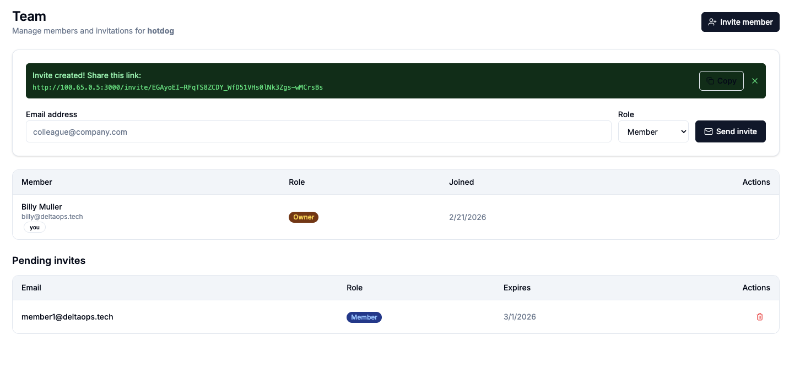
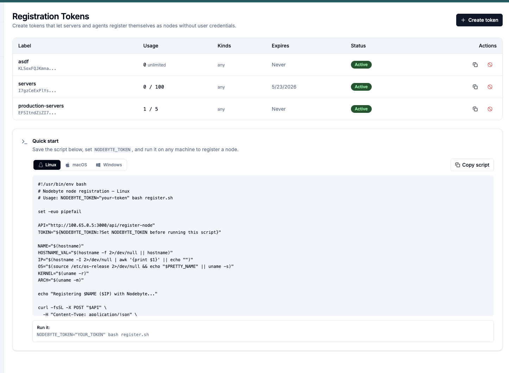
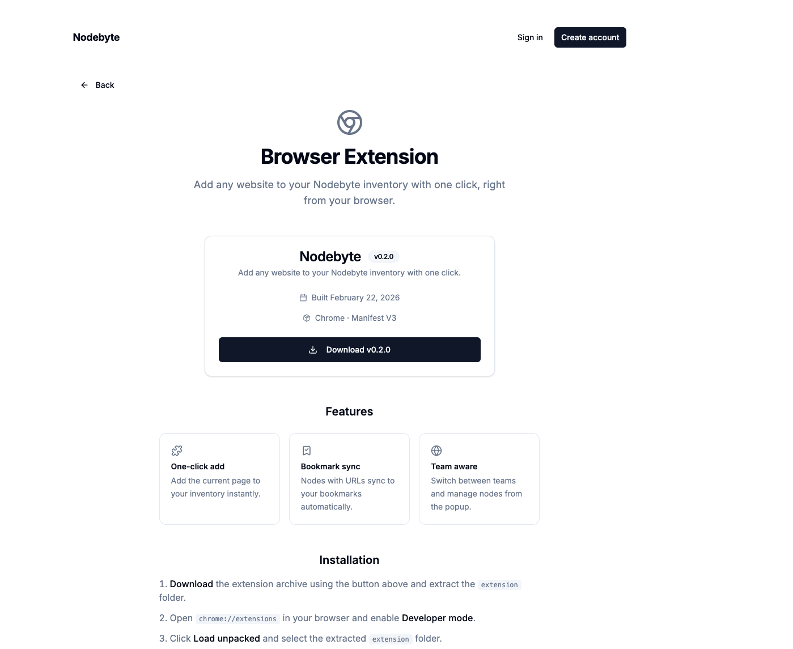
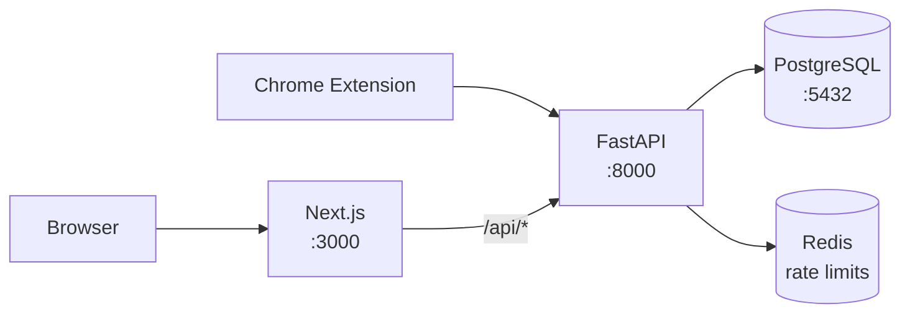

# Nodebyte

A modern digital inventory manager built for IT teams. Track every device, site, and service your team depends on. Search by name, tag, host, IP, or URL. Automate via REST API. Keep your operational knowledge tidy.


## Features

- **Fast search** — find any node instantly by name, hostname, IP, URL, or tags
- **Multi-tenant teams** — create teams with roles (owner, admin, member, viewer) and switch context in one click
- **REST API** — automate node registration from deploy scripts, monitoring, or CI/CD pipelines
- **Registration tokens** — let servers and agents self-register as nodes without user credentials
- **Personal API tokens** — authenticate scripts and integrations with revocable, expiring tokens instead of user passwords
- **Browser extension** — add any website to your inventory with one click (Chrome, Manifest V3)
- **Bookmark sync** — nodes with URLs automatically sync to browser bookmarks, organized by kind
- **Bulk operations** — multi-select nodes to delete or tag in batch
- **Stale inventory review** — triage inactive nodes in bulk, assign an owner, and keep, ignore, or retire them
- **Import reconciliation** — preview authoritative Docker, Kubernetes, and LXD changes before applying, with explicit missing-node retirement
- **Automation health** — see source freshness, failures, summaries, and sync-run history
- **Audit history** — inspect append-only human and automation changes with before/after context
- **Invite system** — invite team members by email with role-based access
- **Super admin console** — platform-wide user and team management for superusers

## Screenshots

| Dashboard | Nodes |
|-----------|-------|
|  |  |

| Team Management | Registration Tokens |
|-----------------|---------------------|
|  |  |

| Browser Extension |
|-------------------|
|  |

## Architecture


```mermaid
flowchart LR
    Browser["Browser"] --> Frontend["Next.js\n:3000"]
    Extension["Chrome Extension"] --> Backend
    Frontend -->|"/api/*"| Backend["FastAPI\n:8000"]
    Backend --> DB[("PostgreSQL\n:5432")]
    Backend --> Redis[("Redis\nrate limits")]
```

The frontend proxies all `/api/*` requests to the backend, keeping auth cookies same-origin. The Chrome extension talks directly to the backend API.

## Prerequisites

- [Docker Engine](https://docs.docker.com/engine/install/) with the [Compose plugin](https://docs.docker.com/compose/install/) (`docker compose`)

That's it. No local Python, Node.js, or PostgreSQL install required.

## Quickstart

```bash
# 1. Clone the repo
git clone https://github.com/your-org/nodebyte.git
cd nodebyte

# 2. Copy the example env file and edit as needed
cp .env.example .env

# 3. Start everything
docker compose up --build
```

Once the containers are healthy:

| Service  | URL                          |
|----------|------------------------------|
| Frontend | http://localhost:3000         |
| API      | http://localhost:8000         |
| API Docs | http://localhost:8000/docs    |

Register your first account at http://localhost:3000/register. The first team is created automatically during registration.

### Invite-only mode

If you set `REGISTRATION_ENABLED=false`, create the first admin user from the command line:

```bash
docker compose exec backend python scripts/create_admin.py
```

The script prompts for email, password, and team name. You can also pass them as environment variables:

```bash
docker compose exec \
  -e ADMIN_EMAIL="admin@example.com" \
  -e ADMIN_PASSWORD="your-secure-password" \
  -e ADMIN_TEAM="My Org" \
  backend python scripts/create_admin.py
```

After that, invite additional users from the Team page in the dashboard.

### Super admin console

Users with `is_superuser = true` get an **Admin** section in the dashboard sidebar with platform-wide management:

- **Overview** — total users, teams, and nodes at a glance
- **Users** — search, activate/deactivate, promote/demote superuser status, or delete any user
- **Teams** — search, view member/node counts, or delete any team

The `create_admin.py` script automatically grants superuser status. To promote an existing user, run:

```bash
docker compose exec backend python -c "
import asyncio
from sqlalchemy import update
from app.db.session import SessionLocal
from app.models.user import User

async def main():
    async with SessionLocal() as db:
        await db.execute(update(User).where(User.email == 'you@example.com').values(is_superuser=True))
        await db.commit()
        print('Done')

asyncio.run(main())
"
```

Or toggle superuser status from the admin console itself once you have at least one superuser.

## Configuration

All configuration is done through environment variables. Set them in your `.env` file or pass them directly to Docker Compose.

### Backend

| Variable | Description | Default |
|----------|-------------|---------|
| `DATABASE_URL` | PostgreSQL connection string | *(set by docker-compose)* |
| `REDIS_URL` | Shared Redis connection for distributed rate limits | `redis://redis:6379/0` |
| `JWT_SECRET` | Secret key for signing JWTs — **change in production** | *(required)* |
| `JWT_ISSUER` | Issuer claim in JWTs | `nodebyte` |
| `ACCESS_TOKEN_EXPIRES_MINUTES` | Access token lifetime | `15` |
| `REFRESH_TOKEN_EXPIRES_DAYS` | Refresh token lifetime | `30` |
| `COOKIE_SECURE` | Set `true` when serving over HTTPS | `false` |
| `COOKIE_SAMESITE` | SameSite cookie policy (`lax`, `strict`, `none`) | `lax` |
| `FRONTEND_ORIGIN` | Allowed CORS origin for the frontend | `http://localhost:3000` |
| `REGISTRATION_ENABLED` | Allow public user registration (`false` = invite-only) | `true` |
| `TURNSTILE_ENABLED` | Enable Cloudflare Turnstile bot protection | `true` |
| `TURNSTILE_SECRET_KEY` | Turnstile secret key (use test key for dev) | *(test key)* |
| `NODEBYTE_ENV` | Environment name (`dev` or `production`) | `dev` |

### Frontend

| Variable | Description | Default |
|----------|-------------|---------|
| `NODE_ENV` | Set to `production` for optimized builds (`next build` + `next start`) | `development` |
| `NEXT_PUBLIC_API_BASE_URL` | Backend API URL (used client-side) | `http://localhost:8000` |
| `NEXT_PUBLIC_TURNSTILE_SITE_KEY` | Turnstile site key (use test key for dev) | *(test key)* |
| `NEXT_PUBLIC_EDITION` | Landing page variant: `cloud` (marketing) or `oss` (minimal) | `cloud` |

### Docker Compose

| Variable | Description | Default |
|----------|-------------|---------|
| `POSTGRES_DB` | Database name | `nodebyte` |
| `POSTGRES_USER` | Database user | `nodebyte` |
| `POSTGRES_PASSWORD` | Database password — **change in production** | `changeme` |
| `POSTGRES_PORT` | Host port for PostgreSQL | `5432` |

## Browser Extension

The Nodebyte browser extension lets you add websites to your inventory with one click.

### Build

```bash
./create-extension.sh
```

This creates `frontend/public/downloads/extension.tar.gz` and an `extension-meta.json` with version info. The download page at `/download` picks these up automatically.

### Install (sideload)

1. Extract the `extension` folder from the archive
2. Open `chrome://extensions` and enable **Developer mode**
3. Click **Load unpacked** and select the `extension` folder
4. Click the Nodebyte icon in your toolbar, open **Settings**, and set your API URL

The extension connects directly to the backend API (e.g. `http://localhost:8000`).

## Authoritative inventory sync

The Docker, Kubernetes, and LXD collectors now create a server-side preview before
they apply changes. Each source owns only the records it has previously synchronized,
so one source cannot retire another source's inventory.

```bash
# Preview only; no node mutation
NODEBYTE_SYNC_MODE=preview ./scripts/docker-inventory.sh

# Preview and apply creates/updates; missing nodes stay unchanged
NODEBYTE_SYNC_MODE=apply ./scripts/docker-inventory.sh

# Explicitly retire records missing from this authoritative snapshot
NODEBYTE_SYNC_MODE=apply NODEBYTE_RETIRE_MISSING=1 ./scripts/docker-inventory.sh
```

Pending previews can also be reviewed under **Dashboard → Automation** and applied
by a team owner or admin. The same page shows source health and recent run summaries.
Every applied mutation is recorded under **Dashboard → Activity**.

## Personal API Tokens and MCP

Create personal API tokens from **Dashboard → Settings** for scripts and integrations.
The plaintext token is shown once, only a SHA-256 lookup hash is stored, and each
token can be given an expiration date or revoked independently. Token requests use
the same team membership and RBAC permissions as the user who created the token.

Use the token as a bearer credential:

```bash
curl https://nodebyte.example.com/api/teams \
  -H "Authorization: Bearer ${NODEBYTE_API_TOKEN}" # gitleaks:allow
```

The bundled MCP server in `mcp/` requires both a Nodebyte personal API token for
backend access and a separate `MCP_TOKEN` protecting inbound MCP requests. See
[`mcp/README.md`](mcp/README.md) for the hardened deployment options.

## Seed Data

A helper script generates 100 random nodes for testing:

```bash
NODEBYTE_EMAIL="you@example.com" NODEBYTE_PASSWORD="yourpassword" python3 scripts/seed_nodes.py
```

You must have a registered account and the backend running on `http://localhost:8000`.

## Production Deployment

Use the production Compose definition so the application runs from immutable,
non-root images without source-code bind mounts or a published database port:

```bash
docker compose -f docker-compose.prod.yml config
docker compose -f docker-compose.prod.yml build
docker compose -f docker-compose.prod.yml up -d --remove-orphans
docker compose -f docker-compose.prod.yml ps
```

Back up the `nodebyte_postgres` volume before applying migrations. The backend
production image applies Alembic migrations before starting Uvicorn. Address
each item in this checklist before the rollout:

- [ ] **`JWT_SECRET`** — set to a long random string (`openssl rand -hex 32`)
- [ ] **`POSTGRES_PASSWORD`** — set to a strong, unique password
- [ ] **`COOKIE_SECURE=true`** — required when serving over HTTPS
- [ ] **`COOKIE_SAMESITE=lax`** — or `strict` if frontend and API share a domain
- [ ] **`FRONTEND_ORIGIN`** — set to your actual frontend URL (e.g. `https://nodebyte.example.com`)
- [ ] **`NEXT_PUBLIC_API_BASE_URL`** — set to your actual API URL
- [ ] **Turnstile** — replace test keys with real Cloudflare Turnstile keys, or set `TURNSTILE_ENABLED=false` to disable
- [ ] **Compose** — use `docker-compose.prod.yml`, which runs Uvicorn without `--reload`
- [ ] **HTTPS** — terminate TLS with a reverse proxy (nginx, Caddy, Traefik) in front of the containers
- [ ] **Volumes** — ensure `nodebyte_postgres` is backed up or mapped to persistent storage

Redis stores short-lived rate-limit windows only; it is intentionally not published
to the host or persisted by the production Compose definition. Keep all backend
replicas on the same `REDIS_URL` so abuse-control budgets remain global.

Refresh tokens are single-use server-side sessions. Replaying a rotated token revokes
the entire session family. Invite and registration secrets are shown once at creation;
only SHA-256 lookup hashes and identifying prefixes are stored afterward.

## API Documentation

The backend auto-generates interactive API documentation:

- **Swagger UI** — `http://localhost:8000/docs`
- **ReDoc** — `http://localhost:8000/redoc`

All endpoints are under `/api/`. Authentication uses JWT bearer tokens with HTTP-only refresh token cookies.

## Project Structure

```
nodebyte/
├── backend/              # FastAPI application
│   ├── app/
│   │   ├── api/          # Route handlers
│   │   ├── core/         # Config, security, RBAC
│   │   ├── models/       # SQLAlchemy models
│   │   ├── schemas/      # Pydantic schemas
│   │   └── services/     # Business logic
│   ├── alembic/          # Database migrations
│   ├── scripts/          # create_admin.py, etc.
│   ├── Dockerfile
│   └── entrypoint.sh
├── frontend/             # Next.js application
│   ├── src/
│   │   ├── app/          # Pages (App Router)
│   │   ├── components/   # React components
│   │   └── lib/          # API client, auth context
│   ├── Dockerfile
│   └── entrypoint.sh
├── extension/            # Chrome extension (Manifest V3)
│   ├── manifest.json
│   └── src/
├── scripts/              # Utility scripts
├── docker-compose.yml       # local development
├── docker-compose.prod.yml  # hardened production runtime
└── create-extension.sh
```

## License

[MIT](LICENSE) — DeltaOps Technology, LLC
